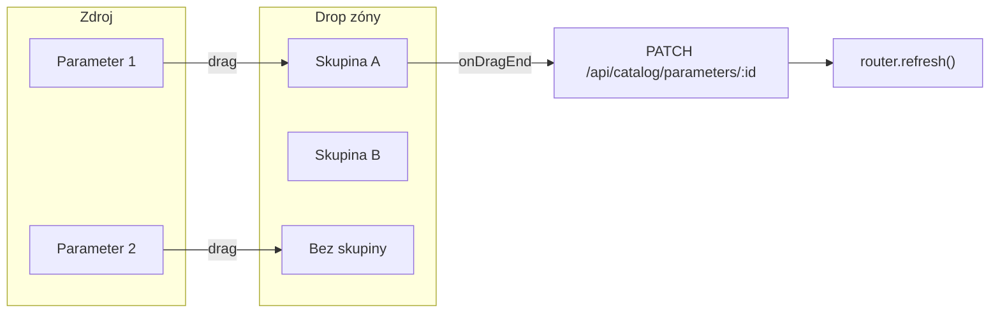

# Plán: Priradenie parametrov do skupín cez drag-and-drop

## Cieľ

- Vytváranie skupín ostáva ako teraz (Pridať skupinu, úprava názvu, zmazanie, poradie hore/dole).
- **Priradenie parametrov:** namiesto dropdownu pri každom parametri bude na vrchu jedna sekcia „Parametre a skupiny“, kde sa zobrazia **skupiny ako drop zóny** a parametre pôjde **presunúť drag-and-dropom** do skupiny (alebo do „Bez skupiny“). Tým sa parameter priradí do skupiny bez manuálneho výberu v selecte.

## Súčasný stav

- [src/app/dashboard/katalog/[slug]/client.tsx](src/app/dashboard/katalog/[slug]/client.tsx): dve karty – „Parametre“ (zoznam parametrov + `<select>` na priradenie skupiny) a „Skupiny parametrov“ (zoznam skupín, Pridať/Upraviť/Zmazať/Hore/Dole).
- API `PATCH /api/catalog/parameters/[paramId]` s `{ groupId?: string | null }` už existuje a používa sa v `handleParamGroupChange`.

## Návrh riešenia

### 1. Knižnica pre DnD

- Pridať **@dnd-kit/core** (a voliteľne **@dnd-kit/utilities** pre pomocné funkcie). Pri implementácii overiť API a typy cez **MCP context7** (dokumentácia @dnd-kit).
- Použiť `DndContext`, `useDraggable` (parameter = draggable), `useDroppable` (každá skupina + jedna zóna „Bez skupiny“ = droppable). Na `onDragEnd` zistiť, nad ktorou drop zónou bol parameter pustený, a volať `PATCH /api/catalog/parameters/[paramId]` s príslušným `groupId` (alebo `null` pre „Bez skupiny“).

### 2. Zmena UI v `client.tsx`

**Layout (v jednej karte alebo logicky prepojenej sekcii):**

- **Hore:** Skupiny v poradí (podľa `sortOrder`) – každá skupina je **droppable** oblasť so názvom a zoznamom parametrov, ktoré do nej už patria (každý parameter **draggable**).
- **Sekcia „Bez skupiny“ / „Ostatné“:** jedna **droppable** oblasť s parametrami bez skupiny (tiež **draggable**).
- Pod tým môže zostať tlačidlo „Pridať skupinu“ a akcie pri skupinách (Upraviť, Zmazať, Hore, Dole) ako teraz.

**Odstrániť:**

- V karte „Parametre“ odstrániť `<select>` pri každom parametri a celkový „plochý“ zoznam všetkých parametrov ako jeden zoznam. Namiesto toho parametre zobrazovať **len v rámci** príslušnej skupiny alebo v sekcii „Bez skupiny“.

**Logika:**

- Rozdeliť `cabinet.parameters` na: parametre v skupine A, v skupine B, …, bez skupiny.
- Každý parameter renderovať ako draggable položku (napr. s ikonou „chytiť“), s `id` parametra v `data` draggable.
- Každú skupinu a „Bez skupiny“ renderovať ako droppable s `id` skupiny (alebo konštanta pre „Bez skupiny“, napr. `NO_GROUP`).
- V `onDragEnd`: z `event.over.id` zistiť cieľovú skupinu (alebo „Bez skupiny“), z `event.active.id` parameter; ak sa skupina zmenila, volať `handleParamGroupChange(paramId, groupId)` (existujúca funkcia, len sa bude volať z DnD).

### 3. Technické detaily

- **Stav:** Po `refresh()` sa načítajú nové dáta zo servera (skupiny a parametre s `group`), takže po dropnutí stačí `router.refresh()` po úspešnom PATCH, ako teraz.
- **Vizuál:** Drop zóny môžu mať napr. minimálnu výšku a zvýraznenie pri `isOver` (ak to @dnd-kit poskytuje), aby bolo zrejmé, kam parameter púšťať.
- **Prístupnosť:** Pri DnD zachovať alebo doplniť text pre čítačky obrazovky (napr. názov skupiny ako drop target).

### 4. Čo sa nemení

- API: žiadna zmena (PATCH parametra, CRUD skupín, reorder skupín).
- Stránka zákazky (zobrazenie parametrov podľa skupín) bez zmeny.
- Vytváranie / úprava / mazanie / reorder skupín v katalógu – správanie ostáva, len vizuálne môže byť „Parametre a skupiny“ v jednej karte s drop zónami hore a parametrami v nich.

## Kroky implementácie (odporúčaný poriadok)

1. Pridať závislosti `@dnd-kit/core` (a podľa dokumentácie z context7 aj potrebné utility).
2. V [src/app/dashboard/katalog/[slug]/client.tsx](src/app/dashboard/katalog/[slug]/client.tsx) obaliť sekciu parametrov a skupín do `DndContext`, definovať droppable pre každú skupinu a pre „Bez skupiny“, draggable pre každý parameter.
3. Implementovať `onDragEnd`: z `event.over` a `event.active` určiť parameter a cieľovú skupinu; ak sa priradenie zmenilo, volať `PATCH` a potom `router.refresh()`.
4. Odstrániť dropdown (`<select>`) z riadkov parametrov a upraviť layout tak, aby parametre boli zobrazené len v rámci skupín / „Bez skupiny“.
5. Voliteľne: vizuálny feedback pri pretiahnutí nad drop zónu (napr. zmena pozadia) a konzistentné štýlovanie drop zón a draggable položiek.

## Diagram toku (DnD)

Pri implementácii **používať MCP context7** na overenie API @dnd-kit (DndContext, useDraggable, useDroppable, event typy, identifikátory droppable/draggable).