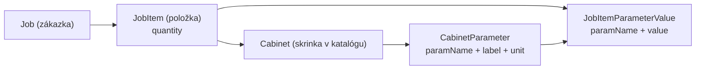

# Plán: Množstvo skriniek v zákazke a labely parametrov

## 1. Kontext a ciele

- **Kontekst**: Aplikácia je Next.js App Router + Prisma backend pre správu katalógu skriniek a zákaziek podľa špecifikácie v [`gannomat_protec_spec_v1_1.md`](gannomat_protec_spec_v1_1.md).
- **Špecifické požiadavky**:
  - `qty` (množstvo skrinky v zákazke) je **len evidenčné** – špecifikácia hovorí, že sa **nesmú duplikovať priečinky** podľa množstva, len sa má množstvo evidovať (L60–L61, L320–L326).
  - Pri **každom parametri** sa má v UI zobraziť aj **label/poznámka** z DB (odvodené z `Description` v `.ganx`, uložené v `CabinetParameter.label`).
- **Cieľ**: 
  - mať konzistentne uložené a zobrazované `quantity` pre `JobItem` (položku zákazky),
  - mať pri parametroch v UI jasné, čitateľné menovky a poznámky z DB.

## 2. Dátový model a service vrstva

- **Overiť a zosúladiť DB model** (Prisma):
  - Skontrolovať v [`prisma/schema.prisma`](prisma/schema.prisma), že:
    - model `JobItem` má pole `quantity Int @default(1)` (alebo ekvivalent),
    - model `CabinetParameter` má polia `paramName`/`key`, `label`, `unit`, prípadne `constraintsJson` podľa aktuálnej implementácie.
  - Ak by `quantity` chýbalo alebo nemalo default, doplniť/opraviť podľa návrhu v špecifikácii (sekcia 11 – `order_items.qty`).
- **Service vrstva** ([`src/lib/job-service.ts`](src/lib/job-service.ts)):
  - Skontrolovať funkcie `addCabinetToJob` a `updateJobItem`, že:
    - prijímajú a zapisujú `quantity` do `JobItem`,
    - pri vytváraní novej položky sa nastaví `quantity` na hodnotu z UI, inak na 1.
  - Ak treba, rozšíriť typ parametrov funkcií (napr. `UpdateJobItemInput`) o `quantity: number`.

## 3. API vrstvy (Route Handlers)

- **Detail položky** – `[src/app/api/jobs/items/[itemId]/route.ts](src/app/api/jobs/items/[itemId]/route.ts)`:
  - Overiť, že `GET` handler vracia pri `JobItem` aj pole `quantity`.
  - V `PUT` handleri:
    - doplniť parsovanie `quantity` z `request.json()` s typovou validáciou (napr. `zod` schema alebo ručné kontroly: celé číslo, `>= 1`),
    - odovzdať `quantity` do `updateJobItem` service funkcie.
- **Pridanie skrinky do zákazky** – `[src/app/api/jobs/[id]/items/route.ts](src/app/api/jobs/[id]/items/route.ts)`:
  - Rozšíriť `POST` handler tak, aby voliteľne prijímal `quantity` (default 1),
  - validovať rozsah podobne ako pri `PUT`,
  - odovzdať `quantity` do `addCabinetToJob`.
- **Typy request body**:
  - Zaviesť alebo upraviť typy/request schemas (napr. `type UpdateJobItemBody = { name: string; width: number; height: number; depth: number; quantity: number; params: ... }`) a používať ich v handleroch pre bezpečnú prácu s `Request` JSON.

## 4. UI – zoznam skriniek v zákazke (množstvo)

- **Komponent**: `[src/app/dashboard/zakazky/[id]/client.tsx](src/app/dashboard/zakazky/[id]/client.tsx)`.
- **Zmeny**:
  - Rozšíriť typ `JobItem` používaný v cliente o `quantity: number` (respektíve prevziať z API typ, ak je už generovaný).
  - V tabuľke/zozname položiek:
    - pridať nový stĺpec alebo vizuálny prvok pre množstvo (napr. samostatný stĺpec `Množstvo` alebo text "x ks" pri názve skrinky),
    - zabezpečiť, aby sa `quantity` zobrazovalo z dát načítaných z `/api/jobs/[id]` alebo z detail API, podľa aktuálnej implementácie.
  - Dbáme na to, aby zobrazenie množstva bolo **len informačné** – bez prepojenia na generovanie `.ganx`.

## 5. UI – detail položky v zákazke (editácia množstva)

- **Komponent**: `[src/app/dashboard/zakazky/[id]/item/[itemId]/client.tsx](src/app/dashboard/zakazky/[id]/item/[itemId]/client.tsx)`.
- **Zmeny**:
  - Rozšíriť lokálny stav/formulár o pole `quantity` (napr. v "Základné údaje" spolu s `width`, `height`, `depth`).
  - Pridať UI prvok pre množstvo:
    - label: "Množstvo" / "Qty", typ `number`, step 1, min 1,
    - validácie na fronte (blokovať záporné hodnoty, nulu, nečíselné vstupy).
  - V `handleSave` (alebo ekvivalentnej funkcii ukladania):
    - zahrnúť `quantity` do request body pre `PUT /api/jobs/items/[itemId]`.
  - Po úspešnom uložení:
    - v prípade použitia server actions/`router.refresh()` rešpektovať odporúčaný pattern z Next.js dokumentácie (Server Actions alebo fetch na route handler),
    - aktualizovať UI tak, aby nová hodnota množstva bola viditeľná aj v zozname skriniek.

## 6. UI – zobrazovanie labelov/poznámok parametrov

- **Detail položky – parametre**: `[src/app/dashboard/zakazky/[id]/item/[itemId]/client.tsx](src/app/dashboard/zakazky/[id]/item/[itemId]/client.tsx)`.
- **Cieľ**: pri každom parametri zobrazovať názov aj poznámku/label z DB.
- **Kroky**:
  - Overiť, že detail API (`GET /api/jobs/items/[itemId]`) vracia pri `cabinet.parameters` polia `paramName`, `label`, `unit`, prípadne ďalšie meta údaje.
  - V UI pri renderovaní parametrov:
    - Použiť `label` ako **hlavný text** (napr. `Label` komponent z `shadcn/ui`),
    - `paramName` zobraziť ako sekundárny text (napr. menší, sivý) alebo tooltip,
    - ak je k dispozícii `unit`, doplniť ju pri hodnote (napr. `mm`, `%`),
    - prípadné rozšírené poznámky (constraints, default) zobraziť ako pomocný text pod inputom.
  - Zabezpečiť, že ak `label` v DB chýba, fallback je na `paramName` (aby UI nikdy neostalo prázdne).
- **Katalóg – parametre**: `[src/app/dashboard/katalog/[slug]/client.tsx](src/app/dashboard/katalog/[slug]/client.tsx)`.
  - Skontrolovať, že zobrazuje rovnaké informácie (label + key + unit) a prípadne zjednotiť štýl s detailom položky v zákazke, aby správanie bolo konzistentné.

## 7. UX a validácie

- **Množstvo (qty)**:
  - Back-end validácia v API (minimálne: celé číslo `>= 1`, prípadne horný limit podľa potreby).
  - Front-end validácie s jasnou chybovou hláškou (napr. "Množstvo musí byť aspoň 1 ks").
  - Žiadne väzby na generovanie priečinkov ani `.ganx` – len uloženie do DB a zobrazovanie.
- **Parametre**:
  - Ak parameter nemá v `CabinetParameter` meta dáta, UI by to malo prežiť (fallback na názov, označenie napr. "(bez popisu)").
  - Udržať prehľadnosť formulára (labely nesmú byť príliš dlhé, prípadne použiť skrátenie + tooltip).

## 8. Testy a kontrola konzistencie

- **Service a API testy**:
  - Pridať/aktualizovať unit testy pre `updateJobItem` a príslušné route handlery, ktoré overia:
    - zápis a čítanie `quantity`,
    - korektnú validáciu vstupov,
    - že existujúce generovanie a recalc logika sa zavolá tak ako predtým.
- **UI/regresné testy (voliteľne)**:
  - Ak sú v projekte E2E (Playwright), doplniť scenár:
    - vytvorenie zákazky,
    - pridanie skrinky s množstvom,
    - úprava množstva v detaile položky,
    - vizuálna kontrola, že sa množstvo zobrazuje v zozname.
- **Kontrola špecifikácie**:
  - Overiť, že výsledné správanie je v súlade so špecom (množstvo len evidencia, žiadna duplikácia priečinkov, parametre jasne pomenované labelmi).

## 9. Diagram dátových vzťahov (pre lepšiu orientáciu)

