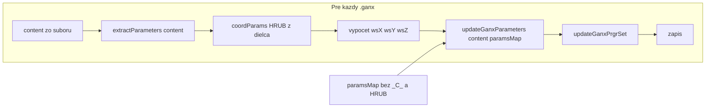

# Offset a HRUB z dielca (nie z DB)

## Cieľ

- **X_C_Y, Y_C_X, HRUB** majú byť špecifické pre každý dielec (každý .ganx súbor má svoje hodnoty).
- Tieto parametre **nebudú v DB** (parameterValues položky zákazky).
- Pri recalcu sa **najprv prečíta z daného dielca** offset (X_C_Y, Y_C_X) a hrubka (HRUB), podľa toho sa vypočíta rozmer dielca (wsX, wsY, wsZ) ako teraz, a výsledok sa zapíše.

## Súčasný stav

- Pri pridání skrinky do zákazky sa všetky parametre z katalógu (`cabinet.parameters`) skopírujú do `JobItemParameterValue` ([job-service.ts](src/lib/job-service.ts) ~riadky 93–98).
- Pri recalcu sa `paramsMap` zostaví z `item.parameterValues` a aplikuje sa na **všetky** súbory cez `updateGanxParameters`, takže hodnoty X_C_Y, Y_C_X, HRUB sú rovnaké pre všetky dielce (z DB).
- Hodnoty pre výpočet ws sa berú z `extractParameters(updatedContent)` – teda po prepísaní z DB.

## Zmeny

### 1. Konštanta pre „per-dielce“ parametre

V [src/lib/job-service.ts](src/lib/job-service.ts) (napr. hneď pod importami) pridať:

- Konštantu alebo helper, ktorý určí, či je parameter „per-dielce“:  

`^[XYZ]*C*[XYZ]$ `alebo `HRUB`.

Použiť ju na jednom mieste (filter pri vytváraní paramsMap a pri vytváraní/update parameterValues).

### 2. Pridanie skrinky do zákazky – neukladať *C* a HRUB do DB

V `addCabinetToJob` v [src/lib/job-service.ts](src/lib/job-service.ts) pri vytváraní `parameterValues.create` filtrovať `cabinet.parameters`:

- Do `create` poslať len parametre, kde `paramName` **nezodpovedá** `^[XYZ]*C*[XYZ]$ `a `paramName !== 'HRUB'`.
- Tým sa X_C_Y, Y_C_X, HRUB vôbec neuložia do `JobItemParameterValue`.

### 3. Recalc – brať offset a HRUB z každého dielca

V `recalcJobItem` v [src/lib/job-service.ts](src/lib/job-service.ts):

- **paramsMap:** zostaviť z `item.parameterValues` tak, že **vylúčime** parametre zodpovedajúce `^[XYZ]*C*[XYZ]$ `a `HRUB`. Tým sa tieto hodnoty z DB neprepíšu do súborov.
- **Poradie v cykle pre každý súbor:**

  1. Načítať `content` zo zdrojového .ganx.
  2. Z **pôvodného** obsahu (`content`) zavolať `extractParameters(content)` a z toho získať `coordParams` (2× *C*) a `HRUB`.
  3. Z týchto hodnôt (špecifických pre tento dielec) vypočítať `wsX`, `wsY`, `wsZ` ako teraz.
  4. Aplikovať `updateGanxParameters(content, paramsMap)` → `updatedContent` (prepíšu sa len „používateľské“ parametre, nie *C*/HRUB).
  5. `updateGanxPrgrSet(updatedContent, { wsX, wsY, wsZ })`, potom LX/LY/LZ a CL* ako teraz.
  6. Zápis do cieľového súboru.

Tým sa výslovne používajú hodnoty z daného .ganx súboru na výpočet rozmerov dielca.

### 4. Update položky – neukladať *C* a HRUB

V `updateJobItem` v [src/lib/job-service.ts](src/lib/job-service.ts) pri spracovaní `data.parameters`:

- Pred upsertom filtrovať kľúče: **neukladať** záznamy, kde `paramName` zodpovedá `^[XYZ]*C*[XYZ]$ `alebo je `HRUB`.
- Ak klient pošle tieto parametre v tele, budú ignorované a nebudú uložené do DB.

### 5. UI

- Formulár detailu položky zobrazuje `item.parameterValues` ([client.tsx](src/app/dashboard/zakazky/[id]/item/[itemId]/client.tsx) ~riadok 194). Po zmene tieto parametre v DB nebudú, takže sa v zozname parametrov **neobjavia** – žiadna úprava UI nie je nutná.
- Voliteľne: v sekcii parametrov pridať krátku poznámku, že offset (X_C_Y, Y_C_X) a hrubka (HRUB) sú pre každý dielec v .ganx a nie sú tu editovateľné.

## Tok dát (rekalc)

## Testovanie

- Jednotkový test v [src/lib/__tests__/job-service.test.ts](src/lib/__tests__/job-service.test.ts): overiť, že pri pridání skrinky sa pre položku nevytvárajú `JobItemParameterValue` pre X_C_Y, Y_C_X, HRUB (ak katalóg tieto parametre má).
- Manuálne: katalóg s viacerými .ganx, kde rôzne dielce majú rôzne X_C_Y/Y_C_X/HRUB; pridať skrinku do zákazky, spustiť recalc a overiť, že vygenerované súbory majú ws vypočítané podľa hodnôt z príslušného dielca, nie jednej spoločnej hodnoty.