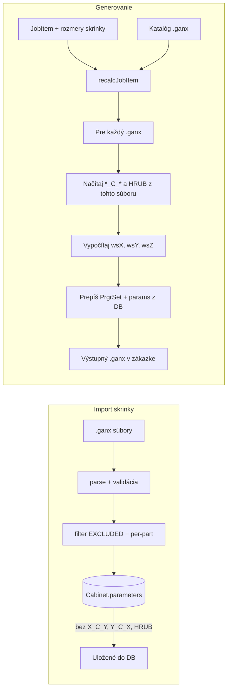

# Per-dielcové parametre: import bez *C* a HRUB, generovanie po dielcoch

## Aktuálny stav

### Import skrinky ([src/lib/cabinet-import.ts](src/lib/cabinet-import.ts))

- Zo všetkých .ganx súborov sa zoberú parametre, deduplikujú a ukladajú do `Cabinet.parameters`.
- Vylúčené sú len: `CLX`, `CLY`, `CLZ`, `LX`, `LY`, `LZ` (riadok 200–204).
- **Problém:** Parametre `X_C_Y`, `Y_C_X` (a ďalšie `*_C_*`) a `HRUB` sa momentálne **ukladajú do DB** pri skrinke, hoci majú byť špecifické pre každý dielec (každý .ganx má iné hodnoty).

### Generovanie / Recalc ([src/lib/job-service.ts](src/lib/job-service.ts))

- **Už je správne:** Pre každý súbor (dielce) v `recalcJobItem` sa:
  1. Načíta obsah **daného** .ganx z katalógu (riadky 174–178).
  2. Z tohto obsahu sa vyčítajú `*_C_*` a `HRUB` (`extractParameters(content)` + filter, riadky 180–194).
  3. Z nich sa vypočítajú `wsX`, `wsY`, `wsZ` pre tento dielec (riadky 211–239).
  4. Do výstupného súboru sa zapíše `updateGanxPrgrSet(..., { wsX, wsY, wsZ })` a používateľské parametre z DB (`paramsMap`), pričom `paramsMap` **neobsahuje** per-dielcové parametre (riadky 165–169).
- Rozmer každého dielca sa teda už počíta z parametrov **tohto** dielca (jeho .ganx), nie zo skrinky v DB.

### Závislosti

- `cabinet-import` nepoužíva `job-service`. Možné je pridať import `isPerPartParam` z `job-service` (žiadny cyklický import).

---

## Pravidlá implementácie

- **Dokumentácia:** Počas celej implementácie používať **MCP context7** na vyhľadávanie a čítanie dokumentácie k používaným knižniciam a API (Prisma, Vitest, Node.js fs, atď.) – pred úpravami kódu overiť správne použitie cez context7.

---

## Zmeny

### 1. Import: neukladať *C* a HRUB do DB pri skrinke

**Súbor:** [src/lib/cabinet-import.ts](src/lib/cabinet-import.ts)

- Pri zostavovaní zoznamu parametrov pre DB (`dbParameters`) vylúčiť aj parametre, ktoré sú „per-dielcové“:
  - názov presne `HRUB`,
  - názov v tvare `[XYZ]_C_[XYZ]` (napr. `X_C_Y`, `Y_C_X`).
- **Implementácia:** Použiť existujúcu funkciu `isPerPartParam` z [src/lib/job-service.ts](src/lib/job-service.ts) (jeden zdroj pravdy) a pred zápisom do DB filtrovať:
  - `const dbParameters = uniqueParameters.filter(p => !EXCLUDED_PARAMS.has(p.paramName) && !isPerPartParam(p.paramName));`
- Validácie zostávajú: každý .ganx musí naďalej **obsahovať** aspoň 2× `*_C_*` a `HRUB` (kontrola pri parsovaní), len sa tieto parametre neukladajú do tabuľky `CabinetParameter`.

### 2. Testy importu

**Súbor:** [src/lib/**tests**/cabinet-import.test.ts](src/lib/__tests__/cabinet-import.test.ts)

- V teste, ktorý kontroluje zápis parametrov do DB (napr. „should not write CLX/CLY/CLZ/LX/LY/LZ parameters to DB“), upraviť očakávania:
  - **Očakávať,** že `X_C_Y`, `Y_C_X` a `HRUB` **nie sú** v `createdNames` (t. j. neukladajú sa do DB).
- Upraviť mock návratu `cabinet.create` tak, aby zoznam `parameters` neobsahoval tieto per-dielcové parametre (v súlade s novým správaním).

### 3. Generovanie

**Súbor:** [src/lib/job-service.ts](src/lib/job-service.ts)

- **Žiadna zmena logiky:** Výpočet rozmerov už prebieha per-dielce (načítanie `*_C_*` a `HRUB` z obsahu daného .ganx a prepis `PrgrSet`).
- Voliteľne: pri sekcii „4a / 4b“ pridať krátky komentár, že rozmer dielca (wsX/wsY/wsZ) sa vždy počíta z prevodových parametrov **tohto** dielca, nie z DB.

### 4. Job-service testy

**Súbor:** [src/lib/**tests**/job-service.test.ts](src/lib/__tests__/job-service.test.ts)

- Test „does not create JobItemParameterValue for per-part params“ môže zostať: stále overuje, že pri pridávaní skrinky do zákazky sa pre X_C_Y, Y_C_X, HRUB nevytvárajú záznamy v `JobItemParameterValue`. Po zmene importu v reále nebude mať skrinka tieto parametre v DB, takže ich `addCabinetToJob` ani nemôže skopírovať; test môže naďalej mockovať skrinku s týmito parametrami a overiť, že sú vyfiltrované.

---

## Tok dát (súhrn)

- **Import:** Per-dielcové parametre sú v .ganx overené, ale do DB skrinky sa neukladajú.
- **Generovanie:** Na každom dielci sa najprv prečítajú prevodové parametre z daného .ganx, podľa nich sa prepočíta rozmer a ten sa prepíše; parametre z DB (bez per-dielcových) sa aplikujú ako doteraz.

---

## Riziká a poznámky

- **Existujúce skrinky v DB:** Ak už máte skrinky importované s X_C_Y, Y_C_X, HRUB v `Cabinet.parameters`, tieto záznamy tam zostanú. `addCabinetToJob` ich už dnes nekopíruje do `JobItemParameterValue` (používa `isPerPartParam`), takže generovanie sa nespoliehajú na ne. Ak chcete mať DB konzistentne bez týchto parametrov, treba jednorazovo vyčistiť alebo znovu importovať skrinky.
- **Jednotná definícia per-part:** Použitie `isPerPartParam` z `job-service` v `cabinet-import` zaručí, že zoznam per-dielcových parametrov je na jednom mieste.

