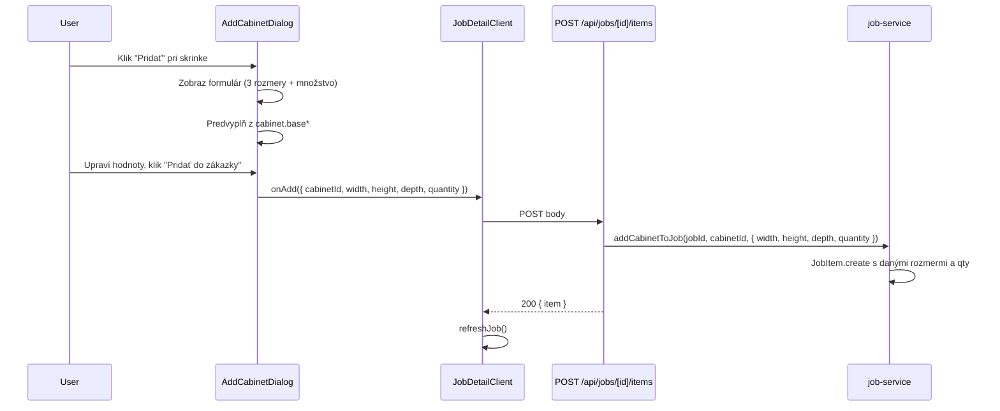

# Plán: Rozmery a množstvo pri pridávaní skrinky do zákazky

## Kontext (zo špecifikácie)

Podľa [gannomat_protec_spec_v1_1.md](gannomat_protec_spec_v1_1.md):

- Sekcia 7: pri pridání skrinky do zákazky používateľ zadáva **nový rozmer (šírka/výška/hĺbka)**, parametre a **qty (len evidencia)**.
- Rozmery skrinky sú v DB v `JobItem` ako `width`, `height`, `depth`; `quantity` je evidencia (bez duplikácie priečinkov).

Aktuálne správanie:

- [AddCabinetDialog.tsx](src/components/AddCabinetDialog.tsx) posiela len `cabinetId`; rozmery sa berú z katalógu (`cabinet.baseWidth/Height/Depth`) v [job-service.ts](src/lib/job-service.ts) pri vytvorení `JobItem`.
- Množstvo je voliteľne v API, default 1; v UI sa nevyplňuje.

## Cieľ

Pred pridáním skrinky mať v UI **3 inputy na rozmer skrinky** (šírka, výška, hĺbka v mm) a **1 input na množstvo** (na dokumentáciu), s možnosťou ich rovno nastaviť; pri pridání tieto hodnoty odoslať na backend a uložiť do položky zákazky.

## Návrh riešenia

### 1. UI – AddCabinetDialog

**Súčasný stav:** Zoznam skriniek z katalógu, pri každej tlačidlo „Pridať“ → volá sa `onAdd(cabinet.id)`.

**Zmena – dva možné prístupy:**

- **Variant A (odporúčaný):** Po kliknutí na „Pridať“ pri konkrétnej skrinke sa **neotvorí nový dialog**, ale v riadku tej skrinky sa zobrazí **rozbalená sekcia** s formulárom: 3 inputy (Šírka, Výška, Hĺbka [mm]) + 1 input (Množstvo). Hodnoty sa predvyplnia z `cabinet.baseWidth`, `baseHeight`, `baseDepth` a množstvo 1. Tlačidlo v tej sekcii napr. „Pridať do zákazky“ odošle `cabinetId` + `width`, `height`, `depth`, `quantity`.
- **Variant B:** Po kliknutí „Pridať“ pri skrinke sa otvorí **druhý krok / sub-dialog** s rovnakým formulárom (3 rozmery + množstvo) a potvrdením.

Odporúčanie: **Variant A** – jednoduchšia navigácia, všetko v jednom dialógu.

**Komponenty:** Použiť existujúce [Input](src/components/ui/input.tsx) a [Label](src/components/ui/label.tsx). Form nemusí byť react-hook-form; stačí lokálny state pre vybranú skrinku a hodnoty (width, height, depth, quantity). Validácia: čísla > 0 pre rozmery, množstvo ≥ 1 (celé číslo).

**Rozhranie:** `onAdd` rozšíriť z `(cabinetId: string) => Promise<void>` na napr. `(payload: { cabinetId: string; width?: number; height?: number; depth?: number; quantity: number }) => Promise<void>`, aby stránka zákazky mohla poslať všetky údaje do API.

### 2. API – POST /api/jobs/[id]/items

**Súbor:** [src/app/api/jobs/[id]/items/route.ts](src/app/api/jobs/[id]/items/route.ts)

- V `body` prijímať okrem `cabinetId` a voliteľného `quantity` aj **voliteľné** `width`, `height`, `depth` (čísla v mm).
- Pred volaním služby normalizovať: ak sú uvedené, použiť ich; validácia napr. kladné čísla (a voliteľne rozumné max). Množstvo ako doteraz: celé číslo ≥ 1.

### 3. Služba – addCabinetToJob

**Súbor:** [src/lib/job-service.ts](src/lib/job-service.ts)

- Rozšíriť `options` o voliteľné `width?: number; height?: number; depth?: number`.
- Pri vytváraní `JobItem` (prisma.jobItem.create):
  - `width`: použiť `options?.width ?? cabinet.baseWidth`
  - `height`: `options?.height ?? cabinet.baseHeight`
  - `depth`: `options?.depth ?? cabinet.baseDepth`
  - `quantity`: už existuje, ponechať z options.

Tým sa zachová spätá kompatibilita (bez nových parametrov sa správanie nezmení).

### 4. Volajúca stránka – JobDetailClient

**Súbor:** [src/app/dashboard/zakazky/[id]/client.tsx](src/app/dashboard/zakazky/[id]/client.tsx)

- `handleAddCabinet` meniť z `(cabinetId: string)` na prijatie objektu s `cabinetId`, `width`, `height`, `depth`, `quantity`.
- Do `fetch(…/items, { body: JSON.stringify({ cabinetId, width, height, depth, quantity }) })` poslať tieto polia podľa toho, čo vráti dialóg.

## Dokumentácia (MCP Context7)

- **shadcn/ui:** Form a Input s Label sú v dokumentácii; pre tento prípad stačí štandardné `Input` + `Label` a lokálny state (prípadne Form + zod pre validáciu neskôr).
- Špecifikácia aplikácie je v [gannomat_protec_spec_v1_1.md](gannomat_protec_spec_v1_1.md) (sekcie 2, 7, 11) – už zohľadnené v pláne.

## Súhrn zmien

| Čo | Kde | Zmena |

|----|-----|--------|

| Dialóg pridávania skrinky | [AddCabinetDialog.tsx](src/components/AddCabinetDialog.tsx) | Rozšírenie o formulár s 3 inputmi (rozmery) + 1 (množstvo), predvyplnenie z katalógu; nový tvar `onAdd(payload)`. |

| API pridania položky | [route.ts](src/app/api/jobs/[id]/items/route.ts) | Prijímať `width`, `height`, `depth`, `quantity` z body; validácia a odovzdanie do služby. |

| Služba pridania skrinky | [job-service.ts](src/lib/job-service.ts) | V `addCabinetToJob` pridať do options `width`, `height`, `depth` a pri vytváraní JobItem ich použiť namiesto base rozmerov. |

| Stránka zákazky | [zakazky/[id]/client.tsx](src/app/dashboard/zakazky/[id]/client.tsx) | `handleAddCabinet` volať s objektom obsahujúcim cabinetId + rozmery + quantity; poslať v POST body. |

## Validácia a edge cases

- **Rozmery:** Ak používateľ nevyplní nejaký rozmer, použiť zodpovedajúci `cabinet.base*` (ako dnes).
- **Množstvo:** Vždy poslať celé číslo ≥ 1 (v UI default 1, v API fallback 1).
- **Typy:** Na fronte posielať čísla (parseFloat/parseInt z inputov), na backende ošetriť neplatné hodnoty (napr. NaN, záporné) a vrátiť 400 s jasnou hláškou.

## Návrh toku (mermaid)

